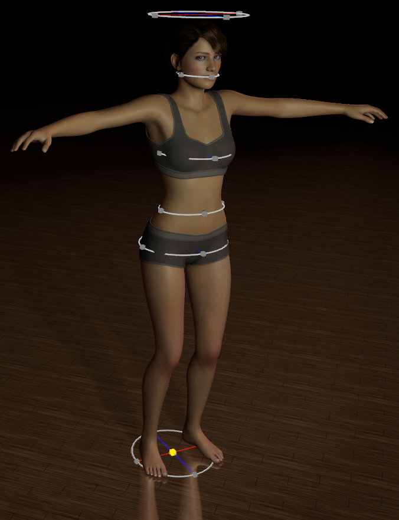

# Virt-A-Mate Snug

Better VR controller alignement in possession mode

## What does it do

Identify the VR model proportions, and displace the VR hands so they fit your own body. For example, touching your navel in reality should also touch the VR model navel, even though it may have different proportions.

This should provide improved realism when touching your own body while possessing a person in Virt-A-Mate.

## Download

Download the latest version's `.var` file in the [Releases](https://github.com/acidbubbles/vam-snug/releases), or download directly [Snug.cs](https://raw.githubusercontent.com/acidbubbles/vam-snug/master/Snug.cs) for VaM versions prior to 1.19.

## How to use

Add `Snug.cs` to a Person atom. You should see rings appear. Those are "anchors", which represents the virtual model proportions.

Play with the "virtual offset" and "virtual scale" values until the rings fit (does't need to be ultra precise).

First, try possessing the model normally and play with the world scale until your arms stretch horizontally naturally (the model shouldn't look like the arms are being teared of, nor be too bended when yours are extended). I also recommend [vam-improved-pov](https://github.com/acidbubbles/vam-improved-pov) to help with the eyes position, otherwise the body will always feel too far behind.

Now to adjust to your own body proportions. For each anchor, adjust the "physical" scale and offset until it matches where your actual hand is. For example, if you touch your own navel, the abdomen physical anchor (white) should touch your controller position.

You should see a yellow line connecting your controller, then the "adjusted" controller position, and finally reach the center of the model. This is only to help visualize the displacement.

You can now proceed with possessing the model. First, uncheck the `Show Visual Cues` checkbox in the plugin UI. Then, possess the person, but do not possess the hands. Finally, check the `Possess Hands` checkbox in the Snug plugin interface.

You can make some finer adjustments to the physical scale and offset, as well as your hands, so that they better align with yours using the Hand Offset and Rotation sliders. You can move your hands in front of your eyes and put your headset on and off until the position matches.

You should now be able to interact with your own body, and have the virtual model do the same thing even though your proportions differ!

## License

[MIT](LICENSE.md)
